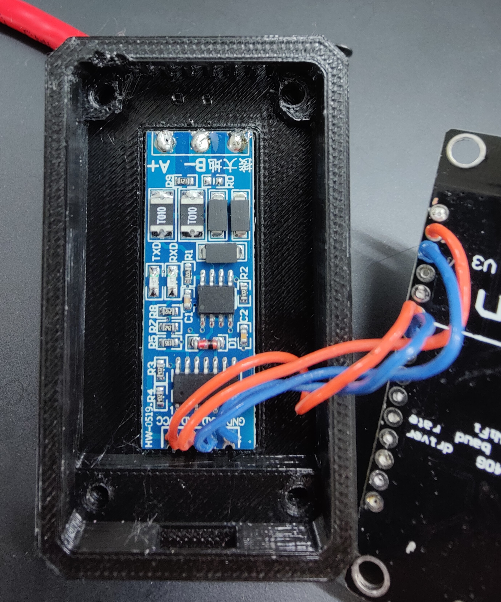
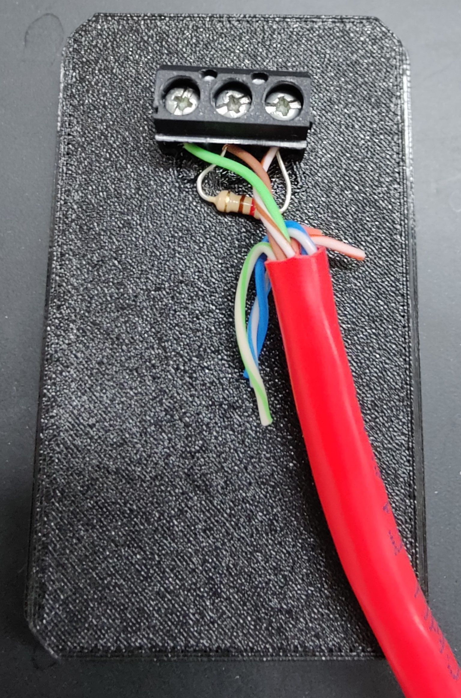

# SDM630-Emulator
Emulate the basic functionality of the Eastron SDM630 using Home-Assistant, MQTT and Arduino

## About
I have a large house. I wanted to install solar cells on my roof. I already have the Eastron SDM630 metering my connection and I am happy to get that information in to my Home-assistant installation.
The Deye inverters support the Eastron meter but by connecting the meter directly would not only require me to pull an absurdly long cable through my house but I would also loose the monitoring ability in Home-assistant.
This project emulates the SDM630 so the home-assistant data can be retained while allowing the inverters to get fast updates on the current power consumption.

## Prerequisites
1. A Home-assistant installation.
2. A MQTT Broker (Mosquitto is usually installed along Home-assistant)
3. ESPHome (installable on Home-assistant)
4. and SDM630 meter (Duh)

## Hardware
The hardware required is the same on each end - An ESP8266 with RS-485 interface. I have opted to use a cheap interface found on ebay and a NodeMCU. I have made a little enclosure for it. Powering the sensor in each end is done by a small USB power supply. nothing fancy.



The enclosure have 3 small holes for screw terminals, from left to right the connections are GND,B,A.

I have added the 120Ohm resistor but I'm not completely sure it's needed (nor the GND wire but hey, it works!)

## Firmware for metering node
For the sensor in the metering end I have used ESPHome. Create a standard sensor and add the following:
```
mqtt:
  broker: IP-TO-THE-BROKER (IP of Home-assistant)
  username: !secret mosquittouser
  password: !secret mosquittopassword

substitutions:
  phase_A: R
  phase_B: S
  phase_C: T

uart:
  rx_pin: 5
  tx_pin: 4
  baud_rate: 9600
  stop_bits: 1

sensor:
  - platform: sdm_meter
    phase_a:
      current:
        name: $phase_A Current
      voltage:
        name: $phase_A Voltage
      active_power:
        name: $phase_A Power
      power_factor:
        name: $phase_A Power Factor
      apparent_power:
        name: $phase_A Apparent Power
      reactive_power:
        name: $phase_A Reactive Power
      phase_angle:
        name: $phase_A Phase Angle
    phase_b:
      current:
        name: $phase_B Current
      voltage:
        name: $phase_B Voltage
      active_power:
        name: $phase_B Power
      power_factor:
        name: $phase_B Power Factor
      apparent_power:
        name: $phase_B Apparent Power
      reactive_power:
        name: $phase_B Reactive Power
      phase_angle:
        name: $phase_B Phase Angle
    phase_c:
      current:
        name: $phase_C Current
      voltage:
        name: $phase_C Voltage
      active_power:
        name: $phase_C Power
      power_factor:
        name: $phase_C Power Factor
      apparent_power:
        name: $phase_C Apparent Power
      reactive_power:
        name: $phase_C Reactive Power
      phase_angle:
        name: $phase_C Phase Angle

    frequency:
      name: "Frequency"
    total_power:
      name: "Total Power"
    import_active_energy:
      name: "Import Active Energy"
    export_active_energy:
      name: "Export Active Energy"
    import_reactive_energy:
      name: "Import Reactive Energy"
    export_reactive_energy:
      name: "Export Reactive Energy"
    
    update_interval: 2s
```
This will make all the data available in Home-assistant.
A few highlights:
1. The MQTT section. by adding this section you will get ALL values sent to the MQTT broker as well. it IS possible to script just the few registers needed for the emulator to work but this is by far the easiest solution.
2. The UART section. On the nodeMCU pin 4 and 5 works fine. YMMW
3. Last line. Update interval. The inverter queries the meter every second. While it is possible to get the sensor to answer faster by requesting less information I rather like the datapoints here. So far the 2 seconds seem to work just great.
4. The names of the phases. I have chosen the R,S,T naming convention (Root-Stem-Top) but you cah choose whichever you want. You just have to update the names in the receiving end as well if you do.


## Firmware for inverter node
See the Arduino sketch supplied in the repo.
You will need the MQTT libary 'PubSubClient' by Nick O'Leary installed to compile this project.
Adjust the section in 'User definitions' accordingly.
